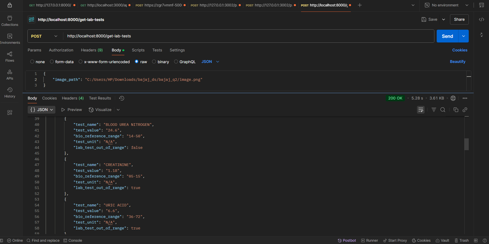

# Lab Report Test Extractor API

A FastAPI-based API that extracts lab test results from medical reports using computer vision and OCR techniques.
Deployed Api URL Endpoint - https://bajaj-q2-i5bv54wdp-aagams-projects-a9a54a9f.vercel.app/api/get-lab-tests
## Prerequisites

- Python 3.8 or higher
- Tesseract OCR
- Virtual Environment (venv)

## Installation

### 1. Install Tesseract OCR

#### Windows
1. Download Tesseract installer from [GitHub](https://github.com/UB-Mannheim/tesseract/wiki)
2. Run the installer
3. Add Tesseract to PATH:
   ```
   C:\Program Files\Tesseract-OCR
   ```

### 2. Set up Python Environment

```bash
# Create virtual environment
python -m venv venv

# Activate virtual environment
.\venv\Scripts\activate

# Install requirements
pip install -r requirements.txt
```

### 3. Requirements File
Create `requirements.txt` with these dependencies:

```txt
fastapi==0.68.1
uvicorn==0.15.0
python-multipart==0.0.5
numpy==1.21.2
opencv-python==4.5.3.56
pytesseract==0.3.8
pydantic==1.8.2
```

## Running the API

1. Activate virtual environment (if not already activated):
```bash
.\venv\Scripts\activate
```

2. Start the FastAPI server:
```bash
cd bajaj_q2
uvicorn app:app --reload --port 8000
```

## Using the API

### Make POST Request

Use Postman or any API client:

- **URL**: `http://localhost:8000/get-lab-tests`
- **Method**: POST
- **Headers**: 
  ```
  Content-Type: application/json
  ```
- **Body** (raw JSON):
  ```json
  {
      "image_path": "your_image.jpg"
  }
  ```

### Expected Response

```json
{
  "is_success": true,
  "data": [
    {
      "test_name": "BLOOD UREA",
      "test_value": "24.6",
      "bio_reference_range": "16-50",
      "test_unit": "mg/dl",
      "lab_test_out_of_range": false
    }
  ]
}
```

## Example Output

### Sample Image


### Sample JSON Response
```json
{
  "is_success": true,
  "data": [
    {
      "test_name": "BLOOD UREA",
      "test_value": "24.6",
      "bio_reference_range": "16-50",
      "test_unit": "mg/dl",
      "lab_test_out_of_range": false
    },
    {
      "test_name": "SERUM SODIUM",
      "test_value": "140.3",
      "bio_reference_range": "135-150",
      "test_unit": "mEq/L",
      "lab_test_out_of_range": false
    }
  ]
}
```

Note: Make sure the `output` directory exists and contains your sample image file named `image.png`.

## Troubleshooting

1. If you get Tesseract not found error:
   - Verify Tesseract is installed
   - Check PATH environment variable
   - Set explicit path in code:
     ```python
     pytesseract.pytesseract.tesseract_cmd = r'C:\Program Files\Tesseract-OCR\tesseract.exe'
     ```

2. If image path error:
   - Use forward slashes (/) in path
   - Provide absolute path
   - Verify image exists

## Project Structure

```
bajaj_q2/
├── api/
│   ├── __init__.py
│   └── routes.py
├── app.py
├── extraction_enhancer.py
├── lab_detector.py
├── requirements.txt
├── vercel.json
└── README.md               
```

## Deployment to Vercel

1. Install Vercel CLI:
```bash
npm i -g vercel
```

2. Login to Vercel:
```bash
vercel login
```

3. Deploy:
```bash
vercel
```

Follow the prompts and select:
- Set up and deploy: Yes
- Which scope: Your account
- Link to existing project: No
- Project name: lab-report-extractor
- Directory: ./
- Override settings: No
